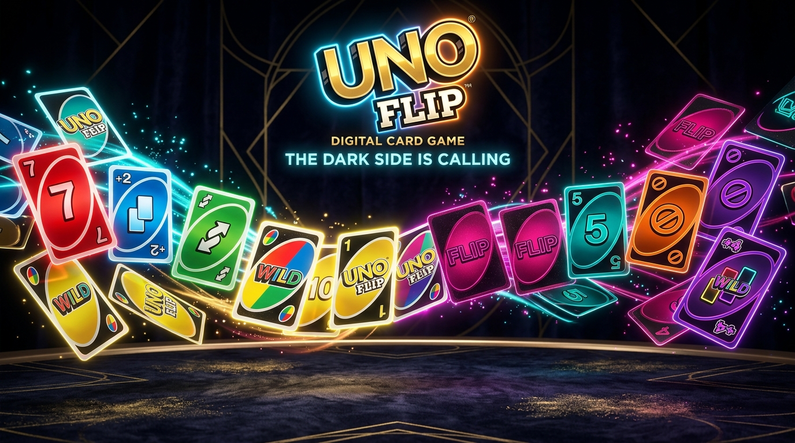
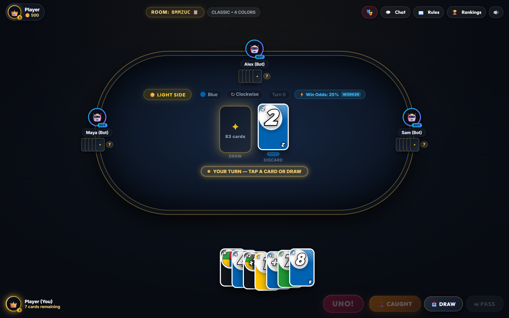
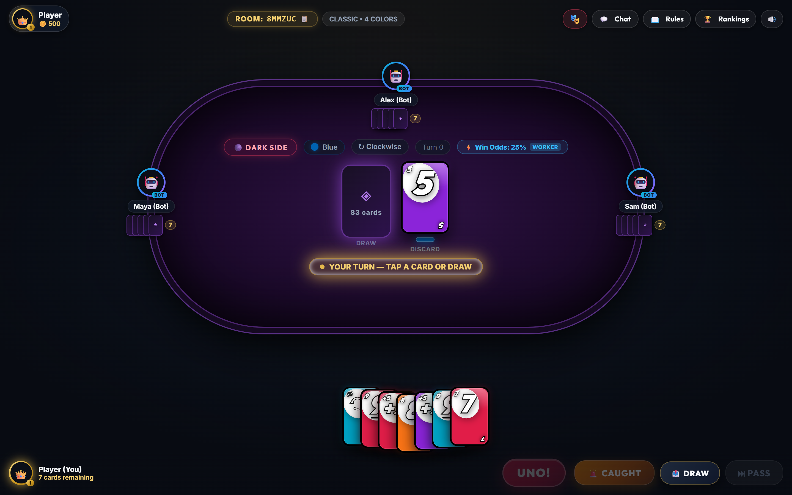
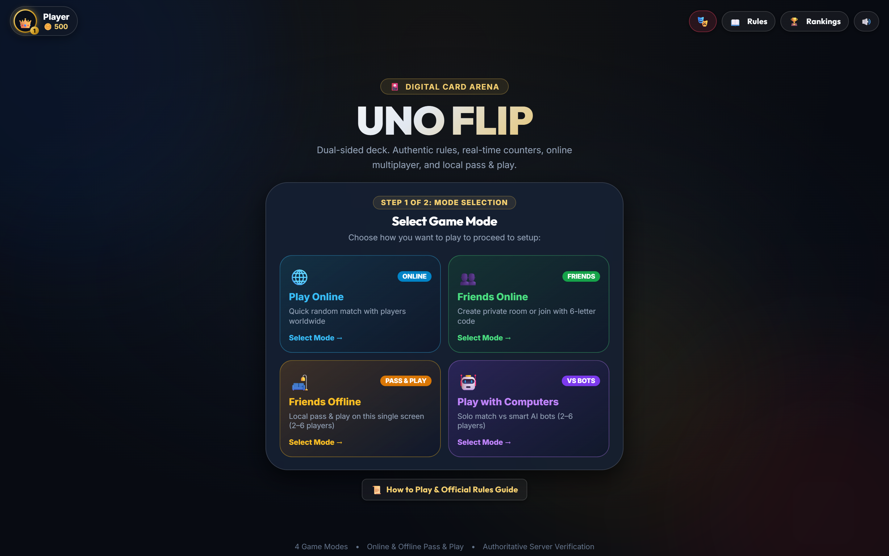
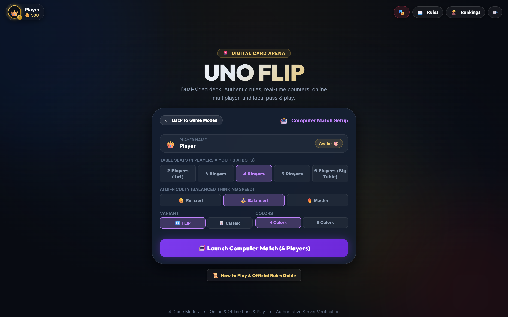
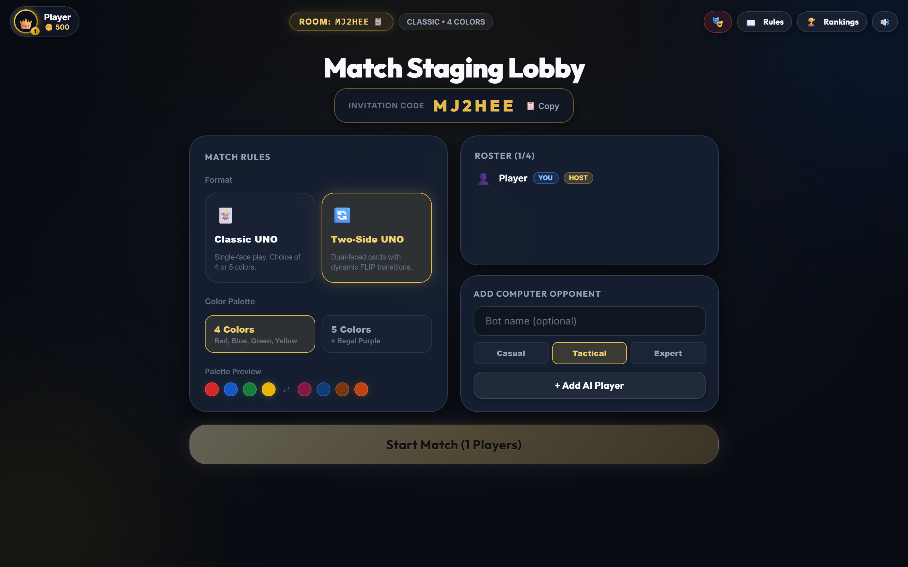
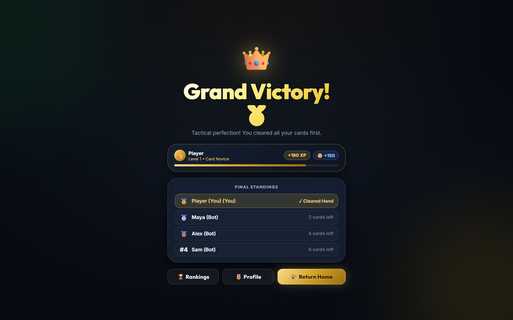
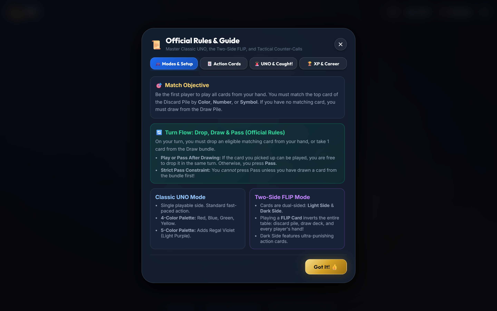
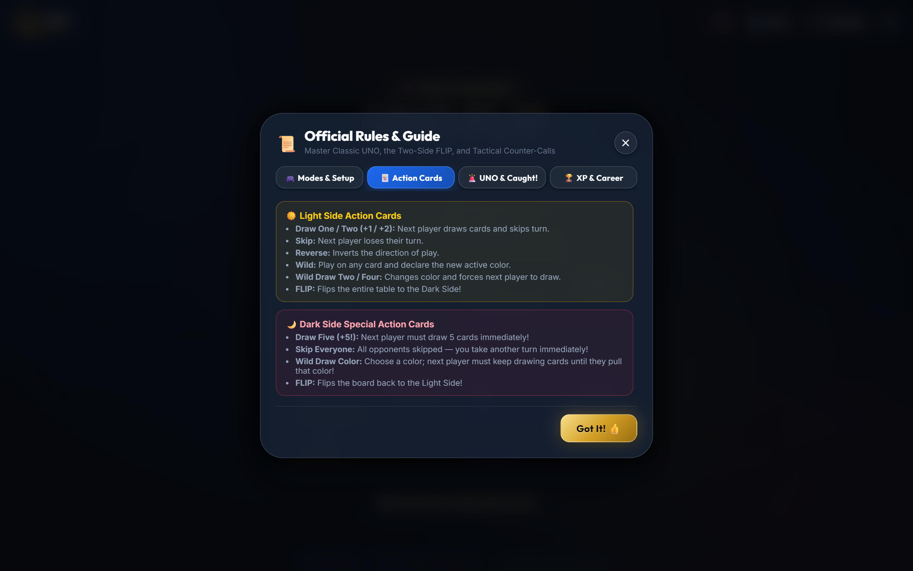

# UNO Flip — Authoritative Digital Card Studio

<p align="center">
  
</p>

<p align="center">
  
  
  
  
  
  
</p>

---

## 🌟 Overview

**UNO Flip — Authoritative Digital Card Studio** is a premier, full-stack, real-time multiplayer implementation of UNO & UNO Flip. Engineered with a **server-authoritative game engine**, zero-cheating information hiding, luxury midnight velvet tabletop aesthetics (`#080b12`), authentic physical card geometry, and a zero-dependency Web Audio synthesizer.

Whether challenging friends online with 6-letter room codes, passing a tablet around the couch in Pass & Play mode, or dueling tactical AI bots, every move is computed securely on the server with sub-millisecond precision.

---

## 📸 Visual Showcase

### 1. Dual-Faced Tabletop Arena
Experience the transition between the vibrant **Light Side** and the punishing **Dark Side** with authentic physical cards, curved fanned player hands, seated opponent avatars, live win odds, and dynamic table felt sizing.

| ☀️ Light Side Arena | 🌙 Dark Side Inversion |
| :---: | :---: |
|  |  |
| *Classic palette (Red, Blue, Green, Yellow), fanned hand, turn HUD* | *Neon palette (Pink, Teal, Orange, Purple), obsidian borders, Draw 5* |

---

### 2. Game Hub & Match Configuration
Hop into 4 dedicated game modes with comprehensive match staging, configurable player seats (2 to 6), custom AI bot difficulty, and 4 vs. 5 color variants.

| 🎴 Digital Card Hub (4 Modes) | ⚙️ Match Configuration |
| :---: | :---: |
|  |  |
| *Online, Friends Online, Pass & Play Offline, vs Computers* | *Select 2–6 seats, AI difficulty (Casual/Tactical/Expert), deck rules* |

---

### 3. Multiplayer Staging & Victory Celebrations
Host private rooms with instant 6-letter room codes, inspect color palette previews, adjust bot lineups, and celebrate victories with animated XP, coins, and standings.

| 👥 Private Match Lobby | 👑 Victory & Progression |
| :---: | :---: |
|  |  |
| *Room code copying, rule badges, player roster, host controls* | *Crown celebration, match standings, career XP & coin gains* |

---

### 4. Official Rules & Action Cards Compendium
In-game comprehensive rulebook and card guide covering classic rules, the Flip mechanic, the Caught challenge window, and tactical counter-calls.

| 📜 Official Rules Guide | 🃏 Action Cards Breakdown |
| :---: | :---: |
|  |  |
| *Turn flow, drop/draw/pass rules, scoring, and 4 vs 5 colors* | *Light side actions vs Dark side special actions (+5, Skip Everyone)* |

---

## 🎮 Game Modes

| Mode | Type | Description | Player Support |
| :--- | :---: | :--- | :---: |
| **Play Online** | 🌐 Online | Fast matchmaking with players worldwide. | 2–6 Players |
| **Friends Online** | 👥 Online | Host private lobbies with shareable 6-letter room codes or join via code. | 2–6 Players + Bots |
| **Friends Offline** | 🛋️ Local | Pass & Play on a single laptop/tablet screen with dynamic seat re-orienting. | 2–6 Players |
| **Play with Computers** | 🤖 Solo | Practice or play offline against smart AI bots with custom difficulty. | 1 Human + 1–5 Bots |

---

## 🃏 Card Compendium & FLIP Mechanics

Cards are dual-sided with independent faces on each side:

```
┌─────────────────────────┐               ┌─────────────────────────┐
│       LIGHT SIDE        │   ── FLIP ──▶ │        DARK SIDE        │
│  White Outer Border     │   ◀── FLIP ── │  Obsidian Black Border  │
│  Red, Blue, Green, Ylw  │               │  Pink, Teal, Orng, Prpl │
└─────────────────────────┘               └─────────────────────────┘
```

### Action Card Differences

| Action | Light Side Effect | Dark Side Effect |
| :--- | :--- | :--- |
| **Draw Card** | **Draw One (+1)** or **Draw Two (+2)** | **Draw Five (+5)** |
| **Skip** | **Skip**: Next player loses their turn | **Skip Everyone**: All opponents skipped; play again immediately! |
| **Reverse** | Inverts turn order | Inverts turn order |
| **FLIP** | Flips all cards to the **Dark Side** | Flips all cards back to the **Light Side** |
| **Wild** | Choose the active color | Choose the active color |
| **Wild Draw** | **Wild Draw Two / Four** | **Wild Draw Color**: Victim draws until they draw the chosen color! |

### The 5th Color Mode
Optionally enable the **5th Color** deck variant:
- **Light Side**: Red, Blue, Green, Yellow + *Light Purple (#8B5CF6)*
- **Dark Side**: Pink, Teal, Orange, Purple + *Earth Brown (#78350F)*

### Official Match Winning Rule
- **Number Card Victory**: A player **cannot win on an action or power card** (`SKIP`, `REVERSE`, `FLIP`, `+1`, `+2`, `+5`, `WILD`, etc.). The winning final card **must be a number card (1–9)**.
- **Strict UNO Button Rule**: The UNO button is enabled **only when** it is the player's turn, they hold exactly 2 cards, and at least one card is legally playable.

---

## 🏛 Architecture & Engineering Philosophy

### 1. Authentic Physical 112-Card Dual-Sided Deck
- **Single Physical Card Entities**: Each card is modeled as one physical double-sided object `{ id, lightSide, darkSide }`.
- **Official Mattel Pairings**: Exactly 112 physical cards with official verified pairings (e.g., Light Blue 6 ↔ Dark Purple Reverse, Light Yellow 3 ↔ Dark Teal 3, Light Green Flip ↔ Dark Wild Draw Color).
- **Flawless Tabletop Flipping**: Inverting the table flips hands, discard piles, and the draw bundle simultaneously without desyncing.

### 2. Groq AI Live Match Referee & Monitor
- **Real-Time Intelligence**: Powered by Groq's high-speed inference engine (`qwen/qwen3.8-27b`).
- **Official Rule Adjudication**: Trained on the complete official Mattel UNO Flip ruleset.
- **Live Match Announcements**: Broadcasts punchy referee commentary on game events (flips, counter stacks, UNO calls, caught penalties, and match finishes) directly to the in-game HUD.

### 3. Authoritative Game Server
- **Zero Information Leakage**: The client never receives opponent cards. Opponents receive only card counts, player IDs, and public table actions.
- **Atomic State Transitions**: Moves, card plays, draws, passes, and challenge windows are evaluated sequentially on the server.
- **True Randomness**: Fisher-Yates deck shuffle powered by Node.js `crypto.getRandomValues()` with rejection sampling.
- **Authoritative Caught Window**: Server-enforced challenge countdown timer for missed UNO shouts.

### 4. Progressive Web Application (PWA) & All-Screen Fit
- **PWA Ready**: Web app manifest, standalone display mode, maskable icons, and a multithreaded service worker (`sw.js`) enabling offline play.
- **All-Screen Geometry**: Responsive CSS scaling ensures fluid gameplay on mobile phones, tablets, foldables, and widescreen monitors with zero button overlap.

### 5. Persistent Database Layer (Supabase PostgreSQL)
- **High Efficiency**: High-frequency ephemeral card actions remain in memory for lightning speed.
- **Relational Integrity**:
  - `user_profiles`: Persistent identity, XP, level, coins, frames, and badges.
  - `matches`: Match logs, winner, turn count, total flips, and standings.
  - `player_stats`: Win rate %, cards played, UNO calls, caught challenges, and highest win streaks.
  - Global real-time leaderboard view.
- **Zero-Config Fallback**: If Supabase credentials are not provided, the server automatically operates in local persistent memory fallback mode with zero downtime or crashes.

### 6. Tactile Audio Synthesizer (`audio.js`)
- **100% Zero-Dependency Web Audio API**: No external MP3 or audio asset loading.
- Generates procedural sound waves for:
  - Crisp card taps and table placements
  - Smooth card draws and deck deals
  - Mechanical riffle card shuffles
  - 3D frequency sweep flip wooshes
  - Resonant major-triad UNO brass shouts
  - Victory fanfares and caught buzzers

---

## ⚡ Quick Start

### Prerequisites
- [Node.js](https://nodejs.org/) (v18 or higher recommended)
- [npm](https://www.npmjs.com/)

### 1. Clone the Repository
```bash
git clone https://github.com/gondchawarswaraj45/UNO_flip.git
cd UNO_flip
```

### 2. Start the Game Server
```bash
cd server
npm install
npm start
```
*The server will listen on `http://localhost:3001`.*

### 3. Start the Client Application
In a separate terminal:
```bash
cd client
npm install
npm run dev
```
*Vite will launch the application at `http://localhost:5173`.*

Open your browser and navigate to `http://localhost:5173`.

---

## 🗄 Optional: Supabase Database Setup

To enable persistent global leaderboards and player accounts across server restarts:

1. Copy `.env.example` to `server/.env`:
   ```bash
   cp server/.env.example server/.env
   ```
2. Add your Supabase credentials to `server/.env`:
   ```env
   SUPABASE_URL=https://your-project-id.supabase.co
   SUPABASE_SERVICE_ROLE_KEY=your-service-role-key-here
   SUPABASE_ANON_KEY=your-anon-key-here
   ```
3. Execute the SQL script in [`supabase/schema.sql`](supabase/schema.sql) in your Supabase SQL Editor.

*(Note: The server automatically detects missing credentials and gracefully falls back to persistent in-memory repository mode).*

---

## 📂 Project Structure

```
UNO_Flip/
├── docs/
│   └── images/                # HiDPI showcase screenshots & 3D render banner
│       ├── banner.jpg
│       ├── 01-landing-hub.png
│       ├── 02-mode-setup.png
│       ├── 03-lobby-room.png
│       ├── 04-gameplay-light.png
│       ├── 05-gameplay-dark.png
│       ├── 06-official-rules.png
│       ├── 07-action-cards-guide.png
│       ├── 08-victory-result.png
│       └── 09-leaderboard.png
├── supabase/
│   └── schema.sql             # Production PostgreSQL / Supabase schema
├── server/
│   ├── src/
│   │   ├── db/                # Supabase client & persistent repository layer
│   │   │   ├── supabaseClient.js
│   │   │   ├── repository.js
│   │   │   └── schema.sql
│   │   ├── engine/            # Authoritative game state machine & rules
│   │   │   ├── config.js      # Game constants & mode settings
│   │   │   ├── shuffle.js     # Cryptographic Fisher-Yates shuffle
│   │   │   ├── cards.js       # Card deck definitions (4-color & 5-color)
│   │   │   ├── rules.js       # Turn validation & playability logic
│   │   │   ├── game.js        # Active game room state machine
│   │   │   └── ai.js          # Heuristic AI bot decision engine
│   │   ├── rooms/             # Room management & matchmaking lifecycle
│   │   │   └── roomManager.js
│   │   ├── sockets/           # Socket.IO event controllers
│   │   │   └── gameSocket.js
│   │   └── index.js           # Express server & REST API
│   ├── package.json
│   └── .env.example
├── client/
│   ├── src/
│   │   ├── components/
│   │   │   ├── screens/       # LandingScreen, LobbyScreen, GameScreen, ResultScreen
│   │   │   ├── game/          # CardComponent, PlayerHand, OpponentArea, UnoButton, etc.
│   │   │   └── ui/            # ArcadeHeader, RulesModal, LeaderboardModal, ProfileModal
│   │   ├── hooks/             # useSocket.js, usePwaInstall.js
│   │   ├── store/             # Zustand gameStore with profile persistence
│   │   ├── utils/             # Web Audio API synthesizer (audio.js) & constants
│   │   └── index.css          # Velvet midnight felt styling & animations
│   ├── index.html
│   ├── vite.config.js
│   └── package.json
├── scripts/                   # Headless screenshot automation scripts
├── .gitignore
├── .env.example
└── README.md
```

---

## 📜 License

This project is licensed under the [ISC License](LICENSE).
Card designs, typography, and gameplay rules are inspired by Mattel's official UNO® & UNO Flip!® games for personal, educational, and non-commercial portfolio use.
